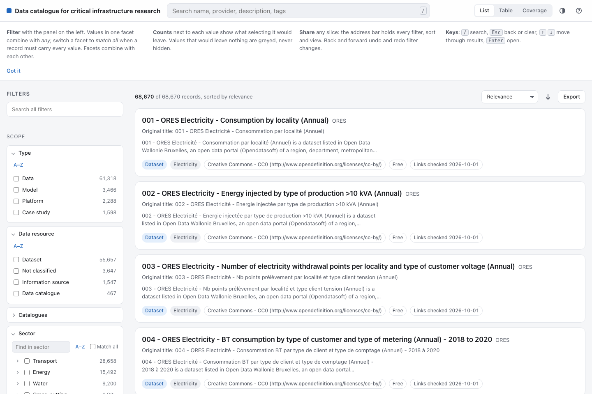

# Data catalogue for critical infrastructure research

[](https://doi.org/10.5281/zenodo.23143543)

Find data sources, models, simulation platforms and documented case studies for infrastructure research in one searchable catalogue.

[Open the dashboard](https://omarkammouh.github.io/Data_catalogue_for_critical_infrastructure_research/) · [User guide](docs/user-guide.md) · [Download a release](https://github.com/omarkammouh/Data_catalogue_for_critical_infrastructure_research/releases) · [Contribute](CONTRIBUTING.md)



## Why this catalogue exists

A recurring difficulty in infrastructure research is described as a lack of data. Often, the immediate problem is finding the resources that already exist. Useful datasets, models and documented applications are distributed across institutional websites, specialist repositories, national portals and software projects. Their descriptions use different languages and terminology. Researchers may spend considerable time searching, overlook relevant work, or rebuild something that is already available.

This project brings resource descriptions and access links together in one place. It helps researchers explore what is available, compare resources and identify inputs for a particular study. Models, platforms and case studies sit alongside data so that users can also find methods and examples of application.

The catalogue is a contribution to the research community. Its purpose is to reduce the effort needed to discover existing resources and support research and innovation in infrastructure systems. Community additions and corrections are welcome.

## What is included

The current dashboard snapshot, captured on 11 October 2026, contains **68,670 resource records**:

| Type | Records |
|---|---:|
| Data and information sources | 61,318 |
| Models | 3,466 |
| Simulation platforms | 2,288 |
| Case studies | 1,598 |

Coverage spans energy, water, transport, digital infrastructure, the built environment, services, industry and cross-cutting infrastructure topics. See [current snapshot metadata](catalog/dashboard-snapshot.json) for the capture date and [methods](docs/methods.md) for scope and inclusion criteria.

The archived v1.0.0 release contains 64,625 records. Its [snapshot metadata](catalog/snapshot.json) and DOI identify that fixed release. The hosted dashboard is updated independently from the release archive.

This repository contains **metadata**, including source links, descriptions, access conditions and citations. Obtain the underlying resources from their providers. Some resources require registration, permission or payment.

## Use the dashboard

1. Open the dashboard and allow the catalogue to load. The full snapshot is large; loading progress is shown.
2. Search by resource name, provider, description or tag. Add filters for resource type, sector, location, format, access conditions or other attributes.
3. Open a record to read its description and follow the provider links. Share the current URL or export the selected metadata as CSV or JSON.

Values within one filter combine with OR by default. Different filters combine with AND. Use “match all” where available to require multiple values within a filter. The [user guide](docs/user-guide.md) explains the controls and [worked examples](docs/use-cases.md) show research tasks.

## Run locally

Python 3.12 and Node.js 22 are the reference environments. macOS and Linux are supported.

```sh
python3 -m venv .venv
source .venv/bin/activate
pip install -r requirements.txt
make build
make serve
```

Open `http://127.0.0.1:8789/`. No backend service or account is required. For development and tests, follow the [developer guide](docs/development.md).

## Contribute

Help extend and improve this shared resource. Suggest a dataset, add a model or case study, correct metadata, report a broken link, improve the documentation, or contribute to the dashboard. Both issues and pull requests are welcome.

Read [CONTRIBUTING.md](CONTRIBUTING.md) for record examples, source requirements and local checks. Omar Kammouh maintains the catalogue and reviews proposed changes.

## Citation and licences

See [CITATION.cff](CITATION.cff) and the [citation guide](docs/citation.md). Cite underlying resources separately when using them in research.

Code uses the [MIT licence](LICENSE). Original catalogue content and documentation use [CC BY 4.0](LICENSE-DATA). Third-party material and linked resources retain their own terms. A record's `licence` field describes the resource it points to.

Resource availability, descriptions and access terms can change. Coverage varies across sectors and locations. Inclusion does not establish suitability for a particular analysis. Read the [limitations](docs/limitations.md) and check the provider's current documentation before use.

Maintained by **Omar Kammouh, Delft University of Technology**.
